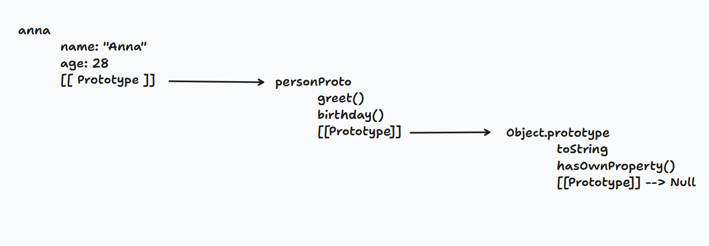

# Javascript Objekte

> Lernziele
> - Prototypeketten
> - Objektmethoden
> - Factory Funktionen
> - Constructor Funktionen
> - class
> - subclass, extend & super

````js
const name = "Anna" // string


const person = {  //objekt, daten sind zusamengefasst
    name: "Anna", //String bzw. Zeichenkette
    age: 28, //int
    city: "Wien"
}
````

- `{}` → Objektliteral
- `name`, `age`, `city` → Properties (Schlüssel)
- `"Anna"`, `28`, `"Wien"` → Werte


### Aufgabe (10 min alleine)

```js
// Erstelle ein Objekt "book" mit folgenden Properties:
//   title   → Titel deines Lieblingsbuches (oder erfinde einen)
//   author  → Autorenname
//   pages   → Seitenzahl
//   isRead  → true oder false

// Dann:
// 1. Gib den Titel mit Dot Notation aus
// 2. Gib den Autor mit Bracket Notation aus
// 3. Füge eine neue Property "rating" mit dem Wert 5 hinzu
// 4. Schreibe eine Methode describe(), die ausgibt:
//    "[title] von [author] – [pages] Seiten"

// Bonusfrage:
// Was gibt book.publisher aus? // undefined
// Was gibt book.publisher.name aus? // TypeError
// Erkläre den Unterschied. //
```

## Prototypen und Prototypenketten

```js
// Wir brauchen viele Personen-Objekte:
const person1 = {
  name: "Anna",
  greet() { console.log(`Hi, ich bin ${this.name}`); }
};

const person2 = {
  name: "Ben",
  greet() { console.log(`Hi, ich bin ${this.name}`); }
};

const person3 = {
  name: "Clara",
  greet() { console.log(`Hi, ich bin ${this.name}`); }
};
```



> „Jedes Objekt in JS hat eine unsichtbare Verbindung nach oben.
> JS läuft diese Kette hoch – bis es findet was es sucht, oder null erreicht."


```js
// TEIL 1: Was gibt dieser Code aus?
// Beantworte OHNE ausprobieren – erkläre deine Antwort.

const base = {
  type: "base",
  describe() {
    return `Ich bin: ${this.type}`;
  }
};

const child = Object.create(base);
child.type = "child";

const grandchild = Object.create(child);

console.log(grandchild.type);         // child
console.log(grandchild.describe());   // Ich bin: child

console.log(child)
delete child.type;
console.log(child)

// console.log(grandchild.type);         // ?
// console.log(grandchild.describe());   // ?
```

```js
// TEIL 2: Baue selbst

// Erstelle ein Objekt "vehicleProto" mit:
//   - einer Methode describe() die ausgibt:
//     "[brand] fährt mit [speed] km/h"
//   - einer Methode accelerate(n) die speed um n erhöht

// Erstelle damit zwei Fahrzeuge:
//   - bike  → brand: "Trek",  speed: 0
//   - car   → brand: "BMW",   speed: 0

// Teste:
//   bike.accelerate(25)
//   car.accelerate(120)
//   bike.describe()
//   car.describe()

// Überprüfe:
//   Liegt describe() auf bike oder auf vehicleProto?
//   Beweis mit hasOwnProperty()
```