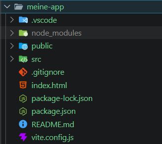

# SPA (Single Page Application)  mit Vujs

> Learnziele
> - Grundlagen & Reaktivität
> - Virtual DOM, Expression, Direktiven (z.b. v-if / v-else, v-for, etc.)
> - Commponents
> -  Routing für SPA

> **„Was passiert, wenn du auf einer normalen Website auf einen Link klickst?"**
- es wird ein HTTP request gemacht eine komplettes html document wird geladen
- das klicken auf einen link auf einer SPA löst keine HTTP requests für andere html documents aus

- SPA seiten werden schneller und wirken wie Desktop-Apps (daher Web app)


**Aufgabe** (im Chat ankündigen, Lernende arbeiten selbst):

> Baut eine kleine Komponente:
> - Ein `ref()` mit eurem Namen als String
> - Ein Button, der den Namen auf `'Vue-Profi'` ändert
> - Zeigt den Namen im Template an

````html
<!doctype html>
<html lang="en">
  <head>
    <meta charset="UTF-8" />
    <meta name="viewport" content="width=device-width, initial-scale=1.0" />
    <script src="https://unpkg.com/vue@3/dist/vue.global.js"></script>
    <title>Document</title>
  </head>
  <body>
    <div id="app">
        <p>Name: {{ name }}</p>
        <button @click="change_to_vue_profi">+1</button>
    </div>

    <script>
        const { createApp, ref } = Vue

        createApp({
            setup() {
                const name = ref('piet')

                function change_to_vue_profi() {
                    name.value = 'Vue-Profi'
                }

                return { name, change_to_vue_profi }
            }
        }).mount('#app')
    </script>
  </body>
</html>
````

- `ref()` brauche ich, wenn ich Daten habe, die sich ändern und die Vue-Ansicht aktualisieren sollen.

## Block 2 Virtuelles DOM, Reaktivität, Expressions & Direktiven

### Virtuelles DOM

### 2. Expressions (Ausdrücke) - echtes JS im Template


````html
<p>{{ name }}</p>
<p>{{ 2 +2 }}</p>
<p>{{ name.toUpperCase() }}p>
<p>{{ isLoggedin ? 'ja' : 'Nein' }}<p>

````

### 3. `reactive()` — Objekte reaktiv machen

### 4. Direktiven

#### v-if / v-else
#### v-for
#### v-bind oder :
    - :src ist kurzform für v-bin:src
#### v-on directive (kurzform ist @) - Events
#### v-model - Two-Way Binding

**statt einem input event wie in:**

```html
<!DOCTYPE html>
<html lang="de">
  <head>
    <script src="https://unpkg.com/vue@3/dist/vue.global.js"></script>
  </head>
  <body>
    <div id="app">

      <input @input="handleInput" placeholder="Tippe etwas..." />
      <p>Eingabe: {{ inputValue }}</p>
    </div>

    <script>
      const { createApp, ref } = Vue

      createApp({
        setup() {

          const inputValue = ref("");
          function handleInput(event) {
            inputValue.value = event.target.value
          }

          return { inputValue, handleInput }
        }
      }).mount('#app')
    </script>
  </body>
</html>
```

**mit v-model**

````html
<!doctype html>
<html lang="en">
  <head>
    <meta charset="UTF-8" />
    <meta name="viewport" content="width=device-width, initial-scale=1.0" />
    <script src="https://unpkg.com/vue@3/dist/vue.global.js"></script>
    <title>Document</title>
  </head>
  <body>
    <div id="app">
      <input v-model="inputValue" placeholder="Tippe etwas" />

      <p>Eingabe: {{ inputValue }}</p>
    </div>

    <script>
      const { createApp, ref } = Vue;

      createApp({
        setup() {
          const inputValue = ref("");
          return { inputValue };
        },
      }).mount("#app");
    </script>
  </body>
</html>
````
> Tippt ihr in das Feld — ändert sich der Text sofort. Kein EventListener, kein `getElementById`. Das ist Two-Way Binding.

### Mini-Übung Todo-Liste

**Aufgabe:**

> Baut eine kleine Todo-Liste:
> - Ein Textfeld mit `v-model`
> - Ein Button „Hinzufügen"
> - Die Liste wird mit `v-for` angezeigt
> - Ist die Liste leer, zeigt `v-if` den Text: *„Noch keine Todos"*

### 3. Übergang: Von HTML-Datei zum Framework-Gerüst



#### Installation 

```bash
npm create vite@latest meine-app -- --template vue
cd meine-app
npm install
npm run dev
```

#### Projektstruktur — nur das Relevante

```
meine-app/
├── index.html          ← Einhängepunkt, nicht anfassen
├── src/
│   ├── main.js         ← createApp() — kennen wir
│   ├── App.vue         ← Wurzelkomponente
│   └── components/     ← hier kommen unsere Components rein
```

| HTML-Datei | Vite-Projekt |
|---|---|
| `const { ref } = Vue` | `import { ref } from 'vue'` |
| Alles in einer Datei | Jede Komponente eigene `.vue`-Datei |
| Kein Terminal nötig: z.b VS code live server extension | `npm run dev` startet Entwicklungsserver |

### Components

### computed() letet werte ab

### Mini-Übung

**Aufgabe:**

> Erweitert die Todo-Liste:
> - `computed()` für die Anzahl **erledigter** Todos
> - Zeigt beide Zahlen an: offen + erledigt